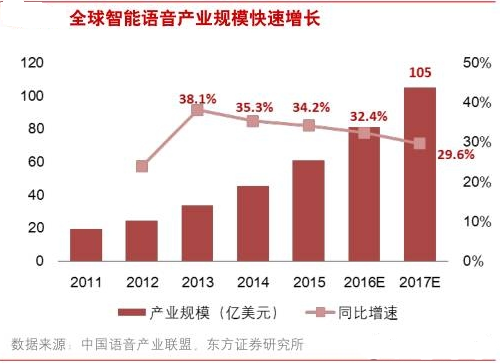
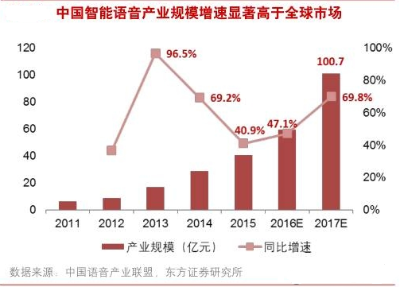
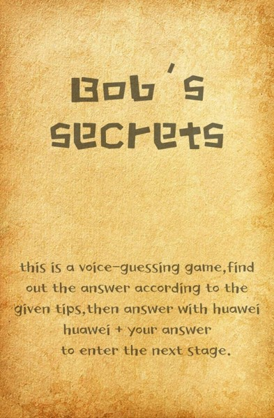
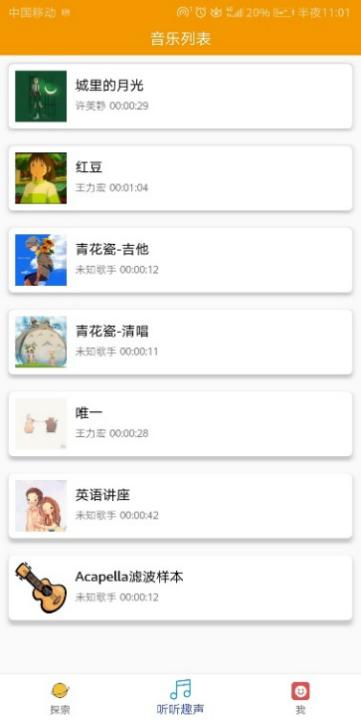
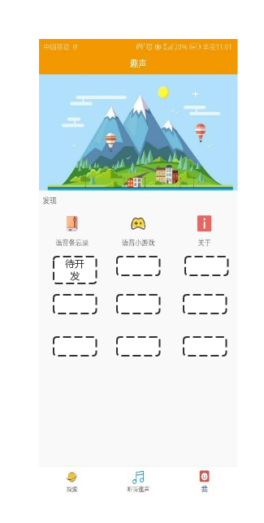
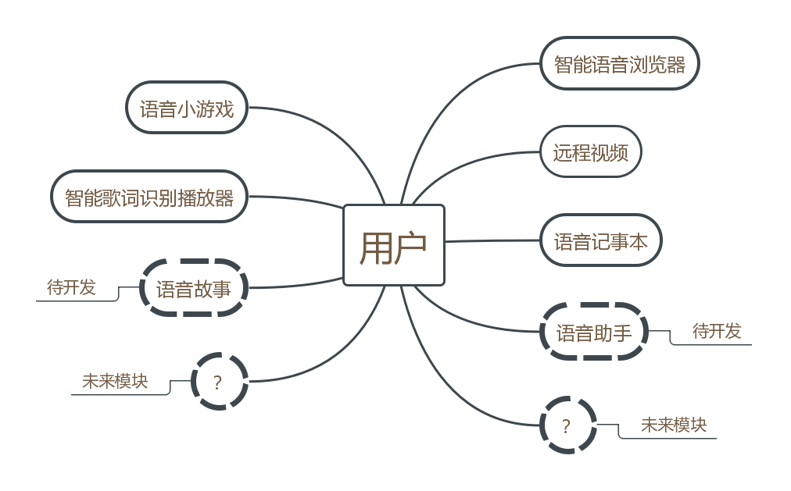
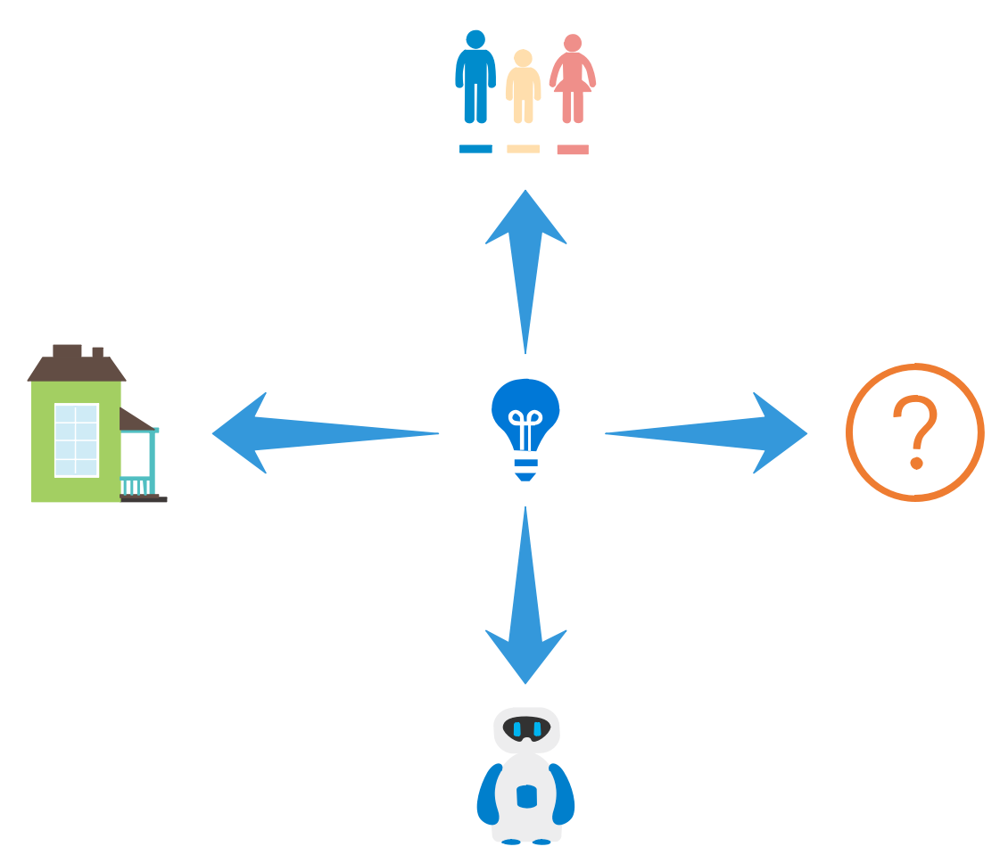

第一章 应用概述

1.1概述

趣声是一款以智能语音技术为核心，具有获取信息、记录信息、娱乐休闲功能的安卓应用。在高效率、信息化、快速化的时代需求下，趣声可以为日常生活的诸多场景，提供智能语音技术服务。其创新点有三：一是以人为本，以完全解放人类双手为目标，将残障人士纳入软件使用的范围；二是模块化设计，使得软件具有可拓展性并可建立以趣声为中心的生态；三是实现了多方语音互操作领域的创新。

趣声内部集成了华为的语音听写、语音唤醒、音频流识别技术，进而展现语音识别技术在歌词识别、浏览器操作、游戏、语音通话等方面全新的革新。

1.2开发背景

背景呈现以下特点：

-   许多领域正在结合智能语音技术

-   全球智能语音产业发展形势一片大好

-   残疾人市场广阔

-   传统的语音交互模式不能满足人们需求

IMS
Research预计到2019年全球将有55%的新车搭载智能语音系统。根据腾讯汽车等相关调研机构的的数据，在智能车载系统的迭代更新过程中，语音交互的作用和重要性受到车主的很大重视；对于快速发展期的智能家居产业，语音控制逐渐成为常见技能点。Statista研究数据显示，2016年全球智能家居市场规模已经达到168亿美元，其中中国市场占7%，预计到2021年全球智能家居市场规模将达到793亿美元，中国市场份额上升至17%；智能语音在可穿戴设备上的渗透促进可穿戴设备产业及智能语音应用的增长。根据市场调研公司Slice
Intelligengce发布的美国无线耳机市场线上销售情况报告，苹果2016年发布的AirPods在上市销售的一个月后迅速占据了无线耳机26%的市场份额。

除了以上所例举的智能语音应用，还有许多与人类生活息息相关的实例，智能语音可以给人类的生活带来巨大的方便，在人们追求高效率及便利的时代，智能语音产业的市场规模正在迅速扩大，在移动互联网、大数据、云计算、深度学习等技术的发展推动下，智能语音技术逐渐成熟，行业发展进入场景应用布局阶段。移动互联网、智能家居、汽车、医疗、教育等领域的应用带动智能语音产业规模持续快速增长。2015年全球智能语音市场规模达62.1亿美元，同比增长34.2%。中国智能语音产业市场规模也逐渐扩大，2015年40.3亿元产业规模约占全球市场份额10%，且增速显著高于全球市场，预计至2017年份额占比将提升至14%。

图1.1全球智能语音产业规模统计图

据中投顾问发布的《2018-2022年中国智能语音行业深度调研及投资前景预测报告》分析显示，智能语音助手设备的全球需求将在2018年从3000万台猛增至5000万台，然后在2020年继续增至8000万台；随着这类设备需求的猛增，相关设备的供应商将进一步加快发展布局。

只能

图1.2 中国智能语音产业规模统计图

在人工智能火爆的现在，无论在国内还是世界的广泛领域内，越来越多的产业都正在搭载智能语音技术这辆快车，而智能语音产业也随着智能语音技术的广泛运用而占据越来越高的市场份额。

语音交互的特点是简单、快速、解放双手和眼睛，在很多场景能够给用户带来巨大的体验优化。2018年中国各类残疾人除聋哑人外的数量为6443万人，使用智能语音技术将给这些人带来无法想象的方便，他们的生活将因为它发生翻天覆地的变化。

智能语音技术正变得越来越重要，人工智能的各方面都将与其有关。

趣声APP通过对华为语音android-sdk下的语音听写、语音唤醒、音频流识别的集成，实现了语音识别技术在现有系统下多场合的应用。传统系统下语音识别技术应用场合十分有限，多数单击事件和其他功能不能被语音所取代，致使智能手机对于残疾人群和一些单击操作不方便的场合得不到广泛运用。受此启发，团队通过实现在应用内集成多个系统应用功能，实现“语音可操作最小系统”展现了语音识别技术强大的应用场景和使用空间。

1.3功能概述

如表1.1，目前趣声共有五个功能，采用模块化设计，而在未来版本将实现更多功能。

| 模块               | 创新亮点                               | 应用场景                                                              |
|--------------------|----------------------------------------|-----------------------------------------------------------------------|
| 智能语音浏览器     | 打破传统模式 细化指令 解决痛点         | 肢体残疾人士、手部使用不方便人群或场景                                |
| 语音游戏           | 结合传统游戏模式和语音交互 说出答案    | 全新的游戏体验，同样的猜谜，不一样的场景                              |
| 语音记事本         | 中英文即时切换 内容智能联想 主题自定义 | 随时随地记录生活，不受手的约束 内容智能联想，让用户的编辑更加丰富有趣 |
| 智能歌词识别播放器 | 华为音频识别技术 Acapella卷积神经网络  | 第三方音频、不完整音频、单或少乐器干扰可滤波音频                      |
| 视频通话字幕辅助   | 实时转写通话内容                       | 听障人群视频通话                                                      |

表1.1 应用功能概述

-   智能语音浏览器

>   通过集成语音唤醒、语音听写技术，实现对浏览器前进、后退、上下滚动、搜索引擎选择、唤醒搜索等功能操作。

-   语音小游戏

>   一个以语音唤醒技术为基础的猜谜游戏，玩家通过界面给出的提示，通过唤醒词唤醒并说出正确答案来闯关，展现了语音唤醒技术在游戏开发场合上的应用。

-   语音记事本

>   对系统下简易记事本进行改进，集成了语音听写技术，在最简单的场合下体现语音听写技术的强大功能，让用户在不打开第三方输入法或外部语音识别引擎的情况下，快捷方便地在记事本内部实现语音听写。

-   智能歌词识别器

>   传统的音乐播放器需要通过外部歌词文件的导入才能向用户提供歌词的展示，而用户音频文件的大部分来源为第三方，歌词文件难以检索，智能歌词识别播放器集成了音频识别技术，通过内部算法实现缓冲区重新采样，在不牺牲音频音质、不改变音频参数的前提下，在线识别歌词文件并导入，根本上解决了第三方音频文件歌词的识别问题。

-   视频通话字幕辅助

>   实时转写视频通话的语音内容，以字幕的形式在屏幕上显示，帮助听障人士进行交流。

1.4 HUAWEI HIAI

趣声靠接入HUAWEI
HIAI实现，共接入了五官特征检测、分词、词性标注、语音识别、实体识别、助手类意图识别、简单背景OCR、ASR引擎8个，表1.2展示了各模块对应的HUAWEI
HIAI。

| 模块               | HUAWEI HIAI                         |
|--------------------|-------------------------------------|
| 语音智能浏览器     | 五官特征检测 分词 词性标注 语音识别 |
| 语音小游戏         | 语音识别                            |
| 语音记事本         | 语音识别 实体识别                   |
| 智能歌词识别播放器 | 语音识别                            |
| 视频通话           | ASR引擎                             |
| 语音故事           | ASR引擎                             |
| 语音助手           | 助手类意图识别、ASR引擎             |

表1.2　模块对应HUAWEI HIAI

下面对HUAWEI HIAI在模块中的应用进行详细描述：

-   语音智能浏览器

>   使用五官特征检测得到眼睛的坐标，聚焦目光位置从而获取点击位置；分词和词性标注则用于搜索引擎进行关键词匹配；而语音识别则用于获取搜索的关键词和相关的语音操作指令。

-   语音小游戏

使用语音识别来获取用户的答案，用于后台的分析确认。

-   语音记事本

>   使用语音识别来获取用户想要记录的内容，而实体识别则用于记事本中的内容智能联想中，当用户输入比如故宫等专有名词时，能够给用户反馈与故宫相关的内容

-   智能歌词识别播放器

>   使用语音识别获取指令，作为一款以完全解放人类双手为目标的app，播放器的使用也要语音化，获取相关的语音指令后将进行对应的操作。

-   视频通话

>   使用ASR引擎获取通话双方的话语内容，然后将其转为文字显示于手机屏幕。

-   语音故事

>   使用ASR引擎来获取用户对于所需故事的相关信息，从而确定要讲的故事并将故事进行播放。

-   语音助手

>   使用ASR引擎与用户进行交流沟通；使用助手类意图识别进行对智能家居的操纵。

第二章 应用模块

2.1语音智能浏览器

| 语音指令 | 结果             | 开发状态 |
|----------|------------------|----------|
| 需要搜索 | 聚焦搜索框       |          |
| 关键词   | 确定关键词       |          |
| 搜索     | 跳转至目标界面   |          |
| 前进     | 前进至下一个界面 |          |
| 后退     | 后退至前一个界面 |          |
| 主页     | 跳转至主页界面   |          |
| 放大     | 将界面放大       |          |
| 缩小     | 将界面缩小       |          |
| 阅读     | 界面滚动         |          |
| 停止     | 界面滚动停止     |          |
| 点击     | 点击进入         |          |

表2.1 语音浏览器指令总览

如表2.1所示，当前智能语音浏览器已经实现了搜索、前进、后退、主页、放大、缩小和阅读七个语音指令对应的操作，实现了半自动操作，所谓半自动操作，即还未完全摆脱手动点击，而智能语音浏览器的目标是使人类完全解放双手而可以实现对网络信息的检索浏览，所以在未来它将通过“面部特征
+
语音”的方式实现人类对手的摆脱，具体实现的关键是对“点击”语音指令的实现：通过人脸特征检测，判断眼睛和嘴唇在视频帧图像中的位置来控制鼠标操作电脑，通过语音来进行指令操作的眼控鼠标系统。

2.2语音小游戏

该语音小游戏有四个界面，有四个语音指令，此游戏给出相应的图片和文字提示，玩家通过这些提示猜到答案后通过念出“华为华为
+ 答案”
的形式触发下一个线索，通过这个游戏，既可以让玩家体验猜谜的新鲜与刺激，又可以让玩家感受语音控制的新奇。目前的语音指令以及其触发的线索如下：

图2.1 语音游戏关卡界面总览

这个语音小游戏只是利用声音来控制游戏的一个简单的示范，在未来的开发中，我们还可以开发一款语音控制的大型手游，可以作为以趣声应用为中心的生态的一环。

2.3语音记事本

与传统的语音记事本不一样，趣声的语音记事本不需要提供第三方输入法或外部语音识别引擎，用户可以直接在记事本内实现语音编辑，高效便捷。

语音提供了用户记录方式的便捷，而未来提供的另一个功能---内容联想，则会给用户带来记录内容的多样化与精细化的体验。内容联想，即当用户在使用此记事本进行编辑时，可以为用户提供相关内容的描述推荐，比如，若用户编辑时有“玉兰”这个关键词时，就会给用户推荐玉兰的图片、描写玉兰的诗歌、与玉兰有关的人物和典故、玉兰的起源等等一切的推荐，若用户需要这些资讯，那么将会给用户带来灵感，给用户的编辑提供灵感，带来愉快的体验。

图2.2 语音记事本的界面

美是所有人的追求，语音记事本除了带来技术上的畅快体验，还可以让用户体验视觉上的享受：自定义界面风格。在最终版本的语音记事本中将会为用户提供多种类型的界面主题，让用户自己定义美。这个可以与之后增添的新模板-----主题self相结合，让用户自己设计主题并自己使用，让用户体验设计美的感受。

2.4智能歌词识别播放器

传统的歌词识别需要从第三方导入歌词文件，对于网络上没有现有歌词文件的歌曲而言，传统歌词识别无法给用户提供歌词，而趣声的智能歌词识别播放器使用音频识别技术，可以识别出任何导入的歌曲的歌词，用户使用此播放器将能够随时随地获取所听歌曲的歌词并将其导出、分享至微信或是QQ等社交平台。

图2.3 歌词识别播放器的界面

**2.5视频通话字幕辅助**

趣声是一个以人为本的人性化软件，除了能够帮助正常人享受更便利的生活之外，同时致力于改善残障人士的生活质量，帮助他们融入到正常的生活之中，而视频通话字幕辅助便是工具之一：在与他人进行视频通话的过程中，传统的视频通话对听障人士很不友好----他们并不能听到对方在说什么，使用视频通话字幕辅助则可以相当完美的解决这个问题。

图2.4 视频通话的界面

第三章 应用前景

3.1 应用模块增添

软件模块化的目的是建立可重用的软件组件，在仅作少量修改甚至是不作修改的情况下便可创建新的软件系统，以提高软件的开发周期性和可靠性，软件模块化可带来以下便利：

1.  具有更好的弹性和可移植性，增加了适用范围；

2.  具有更清晰的定义接口，避免了含混模糊；

3.  具有更好的稳定性，增加了容错率；

4.  具有更好的独立性，避免引用会牵连的模块、进而形成依赖链的问题。

趣声采取的是模块化的设计，可以紧跟时代的潮流、用户的需求来增添新的功能。下面将会例举出几个已经有了想法的模块。

图3.1 模板化示意图

图3.2 各模块示意图

-   语音故事

>   利用人工智能，让人们享受科技的陪伴，听故事不再是什么难事，只要想听，随时随地便可得到。

-   语音助手

>   语音助手是可以渗入用户各个消息提醒的程序，使用此程序，用户自定义想要的提醒的人工语音助手，接下来的各种语音提醒都将有小助手的陪伴。此外，此语音助手还可用于操纵智能家居。

3.2 应用的生态圈

如下图所示，未来将可以围绕趣声建立一个与人们生活息息相关的生态圈。

图3.3 趣声软件的生态圈

-   陪伴

>   现今人们为了生计苦苦奔波，父母忙于工作无法时刻陪伴在孩子身边，基于此，可以开发一款应用程序，同样以语音操作，该应用程序主要功能为利用机器学习，使父母的声音能够被学习，当父母不在孩子身边时可以让父母给孩子讲故事，让孩子感觉父母就在身边，给孩子贴身的陪伴。

-   家居

>   现如今，智能家居变得越来越普遍，在追求方便快捷的新世纪，开发一款新的应用程序，将家居接入此应用程序，通过网络的连接，用户可以在任何地点对家居进行操控。

-   机器人

>   将各种语音类型的声音提供给机器人，这些机器人将给人们带来更亲密的体验。
